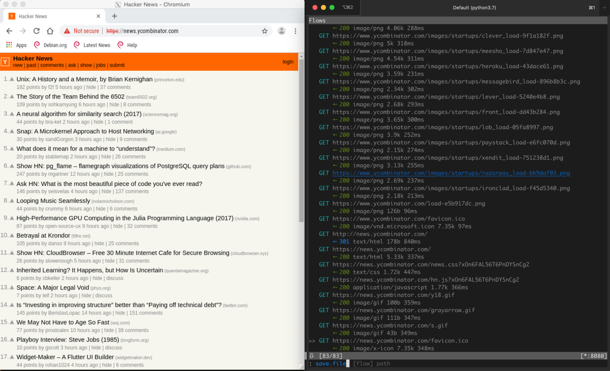

# Dockerized browser with mitmproxy/CA certs installed

## Requirements

- Docker
- Python 3.6+
- openssl
- XQuartz

## Usage

This is a assessment tool that opens a browser (in docker
and shares the X connection) and mitmproxy in the host.

```bash
inspy
```

This is a small demo, once in action:


